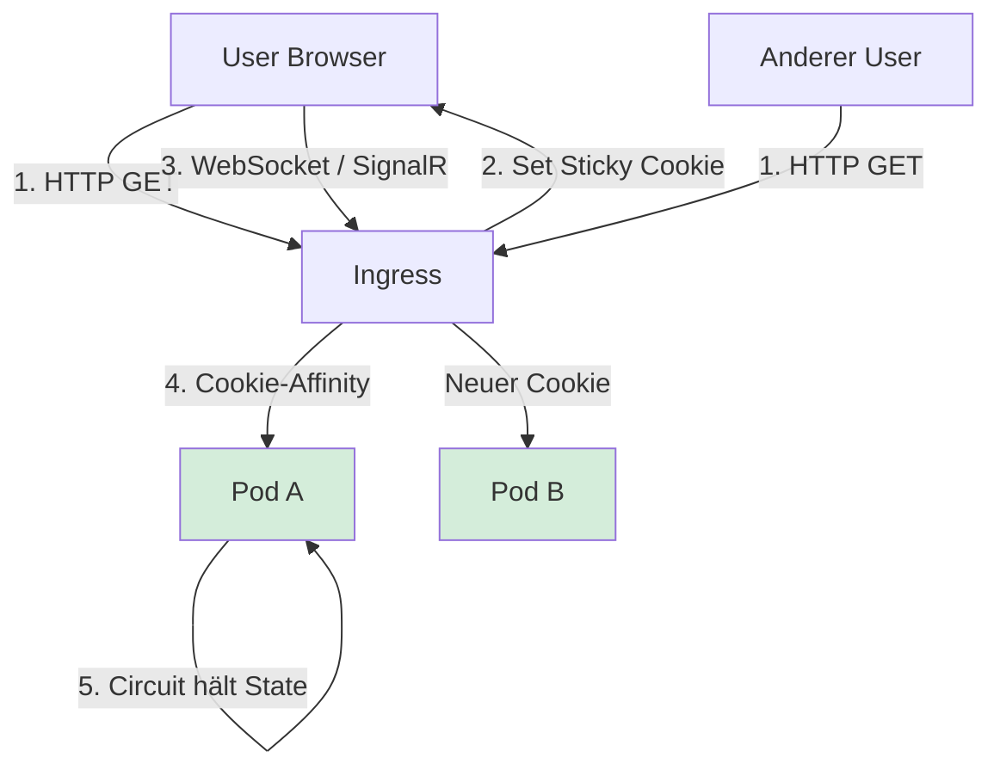

# Cloud-Deployment: Docker & Kubernetes

> **Ziel:** Den Datasheet Analyzer aus dem Standalone-`.exe`-Modus in eine Container-basierte Cloud-Deployment-Strategie überführen. Enthält die Blazor-Server-spezifischen Fallstricke (SignalR/Sticky-Sessions), fertige Dockerfile und k8s-Manifeste, plus einen Vergleich der drei realistischen Azure-Hosting-Ziele.

---

## 1. Die drei realistischen Hosting-Optionen im Vergleich

Bevor wir tief in Docker/k8s einsteigen: für einen internen Analyzer mit überschaubarer User-Zahl gibt es **drei sinnvolle Wege** — nicht immer ist Kubernetes die richtige Antwort.

| Option                          | Wann sinnvoll?                                                    | Komplexität  | Kosten   |
|---------------------------------|-------------------------------------------------------------------|--------------|----------|
| **Azure App Service (Linux)**   | Wenige Nutzer, kein k8s-Know-how, kein Multi-Region-Bedarf        | ? niedrig    | ??       |
| **Azure Container Apps (ACA)**  | Wachstumsplan, Auto-Scaling, aber ohne k8s-Overhead               | ?? mittel    | ????     |
| **Azure Kubernetes Service**    | Mehrere Services, Team hat k8s-Know-how, komplexes Networking     | ??? hoch     | ??????   |

**Empfehlung für den Datasheet Analyzer:** Startet mit **App Service** oder **Container Apps**. Vollständiges AKS lohnt sich erst, wenn ihr mehrere Services, mehrere Umgebungen (dev/stage/prod) und ein Ops-Team habt.

Alle drei Optionen deployen **denselben Docker-Container** — der Aufbau lohnt sich also immer.

---

## 2. Was am aktuellen Setup vor der Cloud raus muss

Der aktuelle `Program.cs` ist für Standalone-`.exe` optimiert:

```csharp
const string EmbeddedAzureConnectionString =
    "DefaultEndpointsProtocol=https;AccountName=storage3csd2rus;AccountKey=jum...";
const string EmbeddedDmsPassword = "mumota12";
```

**Das muss weg, bevor irgendwas in die Cloud geht.** Container-Images landen in Registries, die von mehr Leuten gelesen werden als eine .exe auf einem Nutzer-PC. Credentials im Image = Credentials geleakt.

### Migrationspfad

1. **Env-Vars** haben schon Vorrang im Code — das reicht für den ersten Cloud-Deployment-Schritt.
2. Später auf **Azure Key Vault + Managed Identity** umstellen (siehe Abschnitt 6).
3. Das `EmbeddedAzureConnectionString`-Fallback behaltet ihr für den `.exe`-Modus — aber im Container darf es nie greifen.

Zusätzlich müsst ihr aufpassen:
- **HTTPS/HSTS-Redirect** ist im Code an `!isStandalone` gekoppelt ? im Container läuft der Reverse-Proxy vor euch (Ingress, App Service), TLS terminiert dort, App selbst hört auf HTTP `:8080`
- **HTTP-Port** muss auf einen non-privileged Port (`5000` / `8080`) — kein `80`, weil non-root
- **`ContentRootPath` = `Environment.ProcessPath`** ist im Container ok, aber wir setzen es explizit auf `/app`

---

## 3. Dockerfile

Multi-Stage-Build, non-root User, Linux-native Dependencies für iTextSharp und PDFium.

```dockerfile
# ============================================================================
# STAGE 1 — Build
# ============================================================================
FROM mcr.microsoft.com/dotnet/sdk:8.0 AS build
WORKDIR /src

# Nur .csproj kopieren für besseres Layer-Caching bei restore
COPY DatasheetAnalyzer.Core/DatasheetAnalyzer.Core.csproj DatasheetAnalyzer.Core/
COPY DatasheetAnalyzer.Blazor/DatasheetAnalyzer.Blazor.csproj DatasheetAnalyzer.Blazor/
RUN dotnet restore DatasheetAnalyzer.Blazor/DatasheetAnalyzer.Blazor.csproj

# Restlichen Code kopieren und publizieren
COPY DatasheetAnalyzer.Core/ DatasheetAnalyzer.Core/
COPY DatasheetAnalyzer.Blazor/ DatasheetAnalyzer.Blazor/
RUN dotnet publish DatasheetAnalyzer.Blazor/DatasheetAnalyzer.Blazor.csproj \
    -c Release \
    -o /app/publish \
    /p:UseAppHost=false \
    /p:PublishSingleFile=false

# ============================================================================
# STAGE 2 — Runtime
# ============================================================================
FROM mcr.microsoft.com/dotnet/aspnet:8.0
WORKDIR /app

# Native Dependencies für PDF-Rendering (PDFium via iTextSharp)
# fonts-liberation deckt die meisten Standard-Fonts ab, damit Datenblatt-
# Rendering nicht mit "font not found"-Warnungen crasht.
RUN apt-get update && apt-get install -y --no-install-recommends \
        libgdiplus \
        libc6-dev \
        fonts-liberation \
        libfontconfig1 \
        ca-certificates \
    && rm -rf /var/lib/apt/lists/*

# Non-root user (Sicherheits-Best-Practice, in AKS/ACA teilweise erzwungen)
RUN groupadd -r app && useradd -r -g app -u 10001 app \
    && mkdir -p /home/app /app/tmp \
    && chown -R app:app /home/app /app

COPY --from=build --chown=app:app /app/publish .

USER app

# Blazor-App hört auf HTTP :8080 — TLS wird vom Reverse-Proxy terminiert
ENV ASPNETCORE_URLS=http://+:8080
ENV ASPNETCORE_ENVIRONMENT=Production
# Temp-Verzeichnis für PDF-Zwischendateien (siehe Abschnitt 4)
ENV TMPDIR=/app/tmp

EXPOSE 8080

# Health-Check läuft gegen den bereits vorhandenen /health-Endpoint
HEALTHCHECK --interval=30s --timeout=5s --start-period=30s --retries=3 \
    CMD curl -f http://localhost:8080/health || exit 1

ENTRYPOINT ["dotnet", "DatasheetAnalyzer.Blazor.dll"]
```

### Was hier bewusst so ist

- **Zwei-Stage-Build** hält das Produktions-Image klein (~250 MB statt >1 GB).
- **`libgdiplus` + `fonts-liberation`** brauchen iTextSharp/PDFium für Seitenrendering — ohne die crasht die Vision-Fallback-Pipeline.
- **Non-root User `app`** — in AKS-Clustern mit Pod Security Standards ist root oft blockiert.
- **`ASPNETCORE_URLS=http://+:8080`** — kein HTTPS im Container, das macht Ingress/App Service.
- **Health-Check** nutzt den `/health`-Endpoint, den ihr in `Program.cs` schon habt.

### Build & lokaler Test

```powershell
docker build -t datasheet-analyzer:local .

# Mit Env-Vars für Azure-Zugriff
docker run --rm -p 8080:8080 `
  -e AzureStorage__ConnectionString="DefaultEndpointsProtocol=https;..." `
  -e AzureStorage__ContainerName="data" `
  -e DmsOracle__Host="amm31.rsint.net" `
  -e DmsOracle__ServiceName="ORAMB_RW.rsint.net" `
  -e DmsOracle__User="LLM-VIEW-1GD" `
  -e DmsOracle__Password="..." `
  datasheet-analyzer:local
```

Browser auf `http://localhost:8080` — muss laufen wie die `.exe`.

---

## 4. Zustandsverwaltung im Container

Das aktuelle Setup hat zwei Stellen, die pro Request Dateisystem-Zugriff brauchen:

### 4.1 Temporäre PDF-Dateien

```csharp
string tempPath = Path.Combine(Path.GetTempPath(), Guid.NewGuid() + ".pdf");
```

Im Container ist `Path.GetTempPath()` in der Regel `/tmp`. Das ist:
- **ok für kurzlebige Files** — werden nach `ProcessPdfAsync` gelöscht (`finally`-Block)
- **kein persistentes Volume nötig**
- muss aber **beschreibbar** sein — deshalb im Dockerfile `TMPDIR=/app/tmp` gesetzt und Ownership korrekt

**Warnung:** Wenn ihr in Kubernetes einen readonly-root-filesystem enforced (Pod Security Policy), müsst ihr `/app/tmp` als `emptyDir`-Volume mounten. Beispiel im k8s-Deployment weiter unten.

### 4.2 Analyse-State pro User

Das ist der **kritische Punkt** für horizontales Scaling:

```csharp
builder.Services.AddSingleton<IAnalyzeStateService, AnalyzeStateService>();
builder.Services.AddScoped<ICompareStateService, CompareStateService>();
```

- `AnalyzeStateService` ist als **Singleton** registriert — hält State für alle User im Prozess-RAM
- `CompareStateService` ist als **Scoped** registriert — hält State pro Blazor-Circuit im Prozess-RAM

**Beide sind nicht cross-Pod-fähig.** Wenn du in k8s mit 3 Replicas läufst und der User zwischen zwei Requests auf einen anderen Pod umgeschaltet wird ? State weg, Analyse "verloren".

### Konsequenz für Skalierung

Zwei Optionen:

**Option A — Sticky Sessions (Empfehlung)**
- Ingress leitet einen User immer zu demselben Pod
- Blazor Server braucht das eh (SignalR-Circuit hängt an einem Prozess)
- Keine Code-Änderung nötig
- Bei Pod-Restart geht der Circuit verloren — Blazor Server reconnected automatisch, aber Analyse-State ist weg. Damit müssen User leben.

**Option B — Externer State-Store**
- `AnalyzeStateService`-Werte in Redis / Azure Cache for Redis persistieren
- Kein Sticky-Session-Zwang mehr
- Deutlich mehr Code-Aufwand (Serialisierung, Sync, Race-Conditions)
- Für euren aktuellen Use-Case (User bleibt während einer Analyse verbunden) **overkill**

**Empfehlung:** Option A. Blazor Server erzwingt Sticky-Sessions eh — durch den WebSocket/SignalR-Circuit.

---

## 5. Kubernetes-Manifeste

Minimal, aber produktionstauglich. Namespace `datasheet`.

### 5.1 `namespace.yaml`

```yaml
apiVersion: v1
kind: Namespace
metadata:
  name: datasheet
```

### 5.2 `secret.yaml` (nicht ins Git committen — Beispiel-Struktur)

```yaml
apiVersion: v1
kind: Secret
metadata:
  name: datasheet-analyzer-secrets
  namespace: datasheet
type: Opaque
stringData:
  AzureStorage__ConnectionString: "DefaultEndpointsProtocol=https;AccountName=..."
  DmsOracle__Password: "..."
```

Besser: mit **External Secrets Operator** oder **Azure Key Vault CSI Driver** aus Key Vault ziehen. Siehe Abschnitt 6.

### 5.3 `configmap.yaml`

```yaml
apiVersion: v1
kind: ConfigMap
metadata:
  name: datasheet-analyzer-config
  namespace: datasheet
data:
  AzureStorage__ContainerName: "data"
  DmsOracle__Host: "amm31.rsint.net"
  DmsOracle__FailoverHost: "amm41.rsint.net"
  DmsOracle__Port: "1521"
  DmsOracle__ServiceName: "ORAMB_RW.rsint.net"
  DmsOracle__User: "LLM-VIEW-1GD"
  ASPNETCORE_ENVIRONMENT: "Production"
```

### 5.4 `deployment.yaml`

```yaml
apiVersion: apps/v1
kind: Deployment
metadata:
  name: datasheet-analyzer
  namespace: datasheet
spec:
  # WICHTIG: Bei Blazor Server mit In-Memory-State starten wir mit 1 Replica.
  # Für höhere Verfügbarkeit auf 2–3 hochschrauben, ABER Sticky-Sessions
  # am Ingress aktivieren (siehe ingress.yaml).
  replicas: 1
  selector:
    matchLabels:
      app: datasheet-analyzer
  strategy:
    type: RollingUpdate
    rollingUpdate:
      maxSurge: 1
      maxUnavailable: 0
  template:
    metadata:
      labels:
        app: datasheet-analyzer
    spec:
      securityContext:
        runAsNonRoot: true
        runAsUser: 10001
        fsGroup: 10001
      containers:
        - name: analyzer
          image: <yourregistry>.azurecr.io/datasheet-analyzer:1.0.0
          imagePullPolicy: IfNotPresent
          ports:
            - name: http
              containerPort: 8080
          env:
            # Nicht-sensitive Konfig aus ConfigMap
            - name: ASPNETCORE_ENVIRONMENT
              valueFrom:
                configMapKeyRef:
                  name: datasheet-analyzer-config
                  key: ASPNETCORE_ENVIRONMENT
            - name: AzureStorage__ContainerName
              valueFrom:
                configMapKeyRef:
                  name: datasheet-analyzer-config
                  key: AzureStorage__ContainerName
            - name: DmsOracle__Host
              valueFrom:
                configMapKeyRef:
                  name: datasheet-analyzer-config
                  key: DmsOracle__Host
            - name: DmsOracle__ServiceName
              valueFrom:
                configMapKeyRef:
                  name: datasheet-analyzer-config
                  key: DmsOracle__ServiceName
            - name: DmsOracle__User
              valueFrom:
                configMapKeyRef:
                  name: datasheet-analyzer-config
                  key: DmsOracle__User
            # Sensitive Konfig aus Secret
            - name: AzureStorage__ConnectionString
              valueFrom:
                secretKeyRef:
                  name: datasheet-analyzer-secrets
                  key: AzureStorage__ConnectionString
            - name: DmsOracle__Password
              valueFrom:
                secretKeyRef:
                  name: datasheet-analyzer-secrets
                  key: DmsOracle__Password
          resources:
            requests:
              cpu: "250m"
              memory: "512Mi"
            limits:
              # PDF-Rendering + KI-Response-Parsing peakt kurz — großzügig genug lassen.
              cpu: "1000m"
              memory: "2Gi"
          # Blazor Server startet SignalR, Warmup lädt Azure-Katalog.
          # startupProbe gibt der App 60 Sekunden Zeit fürs Hochfahren.
          startupProbe:
            httpGet:
              path: /health
              port: http
            failureThreshold: 12
            periodSeconds: 5
          livenessProbe:
            httpGet:
              path: /health
              port: http
            periodSeconds: 30
            timeoutSeconds: 5
            failureThreshold: 3
          readinessProbe:
            httpGet:
              path: /health
              port: http
            periodSeconds: 10
            timeoutSeconds: 3
            failureThreshold: 2
          volumeMounts:
            - name: tmp
              mountPath: /app/tmp
      volumes:
        # Temp-Verzeichnis für PDF-Zwischendateien.
        # emptyDir = Pod-lokal, wird bei Pod-Restart geleert (genau richtig).
        - name: tmp
          emptyDir:
            sizeLimit: 500Mi
```

### 5.5 `service.yaml`

```yaml
apiVersion: v1
kind: Service
metadata:
  name: datasheet-analyzer
  namespace: datasheet
spec:
  type: ClusterIP
  selector:
    app: datasheet-analyzer
  ports:
    - name: http
      port: 80
      targetPort: http
```

### 5.6 `ingress.yaml` (nginx-basierter Ingress-Controller)

```yaml
apiVersion: networking.k8s.io/v1
kind: Ingress
metadata:
  name: datasheet-analyzer
  namespace: datasheet
  annotations:
    # === WICHTIG für Blazor Server ===
    # SignalR-Circuits sind an einen Pod gebunden.
    # Ohne diese Cookie-Affinity würden Requests desselben Users auf
    # verschiedene Pods verteilt und der Circuit ständig abreissen.
    nginx.ingress.kubernetes.io/affinity: "cookie"
    nginx.ingress.kubernetes.io/session-cookie-name: "ANALYZER_AFFINITY"
    nginx.ingress.kubernetes.io/session-cookie-max-age: "3600"
    nginx.ingress.kubernetes.io/session-cookie-expires: "3600"
    # WebSocket-Support für SignalR (nginx macht das defaultmäßig,
    # aber explizit ist besser).
    nginx.ingress.kubernetes.io/proxy-read-timeout: "3600"
    nginx.ingress.kubernetes.io/proxy-send-timeout: "3600"
    # 50 MB Upload-Limit für PDFs (siehe Home.razor: maxAllowedSize).
    nginx.ingress.kubernetes.io/proxy-body-size: "50m"
spec:
  ingressClassName: nginx
  tls:
    - hosts:
        - datasheet.rsint.net
      secretName: datasheet-tls
  rules:
    - host: datasheet.rsint.net
      http:
        paths:
          - path: /
            pathType: Prefix
            backend:
              service:
                name: datasheet-analyzer
                port:
                  number: 80
```

### 5.7 Deploy

```powershell
kubectl apply -f k8s/namespace.yaml
kubectl apply -f k8s/configmap.yaml
kubectl apply -f k8s/secret.yaml
kubectl apply -f k8s/deployment.yaml
kubectl apply -f k8s/service.yaml
kubectl apply -f k8s/ingress.yaml

kubectl -n datasheet get pods -w
kubectl -n datasheet logs -f deploy/datasheet-analyzer
```

---

## 6. Credentials-Management

Aktuell steht das in `Program.cs` hart drin. Migrations-Pfad in drei Stufen:

### Stufe 1 — Env-Vars (funktioniert sofort)

Der Code liest schon Env-Vars mit Vorrang. Für den Cloud-Betrieb einfach:
- ConfigMap für nicht-sensitive Werte
- Secret für Passwörter / Connection Strings
- eingebettete Fallback-Konstanten in `Program.cs` **entfernen** oder auf leere Strings setzen — sonst landen sie im Image

### Stufe 2 — Azure Key Vault + CSI Driver (empfohlen)

```yaml
apiVersion: secrets-store.csi.x-k8s.io/v1
kind: SecretProviderClass
metadata:
  name: datasheet-analyzer-kv
  namespace: datasheet
spec:
  provider: azure
  parameters:
    usePodIdentity: "false"
    useVMManagedIdentity: "true"
    userAssignedIdentityID: "<uid-der-managed-identity>"
    keyvaultName: "rs-datasheet-kv"
    objects: |
      array:
        - |
          objectName: azure-storage-cs
          objectType: secret
        - |
          objectName: dms-oracle-password
          objectType: secret
    tenantId: "<tenant-id>"
  secretObjects:
    - secretName: datasheet-analyzer-secrets
      type: Opaque
      data:
        - objectName: azure-storage-cs
          key: AzureStorage__ConnectionString
        - objectName: dms-oracle-password
          key: DmsOracle__Password
```

Vorteile:
- Rotieren von Credentials ohne Redeploy
- Zentraler Audit-Log wer wann Zugriff hatte
- Trennung Ops vs. Entwickler

### Stufe 3 — Managed Identity direkt in der App (langfristiger Zielzustand)

Für **Azure Storage** und **Azure OpenAI** könnt ihr komplett auf Connection-Strings verzichten und stattdessen die Managed Identity des Pods (Workload Identity in AKS) verwenden:

```csharp
// Statt Connection-String:
var blobClient = new BlobServiceClient(
    new Uri("https://storage3csd2rus.blob.core.windows.net"),
    new DefaultAzureCredential());
```

Braucht Code-Änderungen in `RemoteConfigService`, aber eliminiert Storage-Keys komplett. **Oracle DMS** bleibt bei Benutzer/Passwort — das läuft nicht über Managed Identity.

---

## 7. Blazor-Server-spezifische Fallstricke — Zusammenfassung



| Problem                                     | Wenn nicht gelöst                                   | Lösung                                                   |
|---------------------------------------------|-----------------------------------------------------|----------------------------------------------------------|
| SignalR-Circuit an einen Pod gebunden       | Circuit-Abbruch bei jedem Request                   | **Sticky Sessions** am Ingress (Cookie-Affinity)         |
| WebSocket-Timeouts von Proxys getötet       | User bekommt "Trying to reconnect..."-Banner        | `proxy-read-timeout`/`proxy-send-timeout` auf 3600 s     |
| PDF-Upload > default body-size (1 MB)       | 413 Payload Too Large                               | `proxy-body-size: 50m` (matcht `maxAllowedSize` im Code) |
| State im Prozess-RAM                        | User verliert Analyse bei Pod-Restart               | Aktzeptieren + kleines Replica-Count, oder Redis         |
| Warmup lädt Azure-Katalog beim ersten Req.  | Erster User wartet 5 sec                            | `ApplicationStarted`-Hook läuft schon ?                  |
| Container startet mit "kalt" abhängigen Services | Liveness-Probe killt Pod bevor er ready ist   | `startupProbe` mit großzügiger `failureThreshold`        |

---

## 8. CI/CD-Skizze

### 8.1 Azure Container Registry als Image-Store

```powershell
# Einmalig
az acr create --resource-group rg-datasheet --name rsdatasheetacr --sku Basic

# Bei jedem Build
az acr login --name rsdatasheetacr
docker build -t rsdatasheetacr.azurecr.io/datasheet-analyzer:1.0.0 .
docker push rsdatasheetacr.azurecr.io/datasheet-analyzer:1.0.0
```

### 8.2 GitLab CI Pipeline (an eurem `code.rsint.net`-Setup)

```yaml
stages:
  - build
  - deploy

variables:
  IMAGE_TAG: $CI_REGISTRY_IMAGE:$CI_COMMIT_SHORT_SHA

build:
  stage: build
  image: docker:24
  services:
    - docker:24-dind
  script:
    - docker login -u "$CI_REGISTRY_USER" -p "$CI_REGISTRY_PASSWORD" $CI_REGISTRY
    - docker build -t $IMAGE_TAG .
    - docker push $IMAGE_TAG

deploy:
  stage: deploy
  image: bitnami/kubectl:latest
  script:
    - kubectl -n datasheet set image deployment/datasheet-analyzer analyzer=$IMAGE_TAG
    - kubectl -n datasheet rollout status deployment/datasheet-analyzer
  only:
    - main
```

---

## 9. Alternative: Azure Container Apps statt AKS

Für euren Scope (interne App, überschaubare Nutzerzahl) ist AKS oft überdimensioniert. **Azure Container Apps** löst dieselbe Aufgabe mit deutlich weniger Overhead:

- Dasselbe Docker-Image wie oben
- Ingress + TLS + Sticky-Sessions **out-of-the-box**
- Managed Identity, Key Vault-Integration, Scale-to-Zero
- Kein Kubernetes-Cluster zu pflegen
- Konfiguration per Portal, Bicep oder Terraform

Deployment als Bicep-Snippet:

```bicep
resource containerApp 'Microsoft.App/containerApps@2024-03-01' = {
  name: 'datasheet-analyzer'
  location: location
  properties: {
    managedEnvironmentId: environmentId
    configuration: {
      ingress: {
        external: true
        targetPort: 8080
        transport: 'auto'
        stickySessions: {
          affinity: 'sticky'
        }
      }
      secrets: [
        {
          name: 'azure-storage-cs'
          keyVaultUrl: 'https://rs-datasheet-kv.vault.azure.net/secrets/AzureStorageCs'
          identity: 'system'
        }
      ]
    }
    template: {
      containers: [
        {
          name: 'analyzer'
          image: 'rsdatasheetacr.azurecr.io/datasheet-analyzer:1.0.0'
          resources: {
            cpu: json('0.5')
            memory: '1Gi'
          }
          env: [
            {
              name: 'AzureStorage__ConnectionString'
              secretRef: 'azure-storage-cs'
            }
          ]
          probes: [
            {
              type: 'Liveness'
              httpGet: { path: '/health', port: 8080 }
              periodSeconds: 30
            }
          ]
        }
      ]
      scale: {
        minReplicas: 1
        maxReplicas: 3
      }
    }
  }
}
```

**Empfehlung:** Wenn eure Team-Struktur klein bleibt und ihr keinen k8s-Betrieb aufbauen wollt, ist ACA die pragmatischere Wahl.

---

## 10. Checkliste vor dem ersten Cloud-Deploy

- [ ] Eingebettete Credentials in `Program.cs` entfernt bzw. auf leer gesetzt
- [ ] `AzureStorage__ConnectionString` als Env-Var / Secret verfügbar gemacht
- [ ] `DmsOracle__Password` als Secret hinterlegt
- [ ] HTTPS-Terminierung an Ingress/App Service verlagert, App auf HTTP :8080
- [ ] Dockerfile lokal getestet mit `docker run`
- [ ] Image in Azure Container Registry (oder GitLab Registry) gepusht
- [ ] Sticky-Sessions am Ingress konfiguriert (für Blazor Server Pflicht)
- [ ] `proxy-body-size` auf mindestens 50 MB gesetzt
- [ ] WebSocket-Timeouts auf 3600 s
- [ ] Startup-, Liveness-, Readiness-Probes gesetzt
- [ ] Netzwerkzugriff auf Oracle DMS aus dem Cluster erlaubt (VNet-Peering / Private Endpoint)
- [ ] Log-Aggregation eingerichtet (Log Analytics / Loki)
- [ ] Cost-Monitoring aktiv (v. a. für Azure OpenAI-Aufrufe)

---

## 11. Grenzen dieser Architektur

Ehrlich gesagt — wo diese Cloud-Deployment-Variante wackelig wird:

- **Multi-User-Concurrency:** Solange State im Prozess-RAM liegt, blockiert eine hängende Analyse (z. B. langsames Azure OpenAI) den ganzen Pod-CPU-Slot. Nicht dramatisch bei 5–10 Usern, wird schmerzhaft ab 50+.
- **Große PDFs:** Vision-Rendering von 15 hochaufgelösten Seiten kann kurz > 1 GB RAM peaken. Resource-Limits entsprechend setzen.
- **Oracle-DMS-Konnektivität:** Aus einem öffentlichen AKS/ACA-Cluster kommt ihr nicht ohne VPN/Peering in `rsint.net` rein. Klärt das **vor** dem Deployment mit dem Netzwerk-Team.
- **Azure OpenAI ist single-region:** Wenn ihr Multi-Region-HA wollt, braucht ihr Deployments in mehreren Regionen und Traffic-Splitting.

Für den aktuellen Use-Case (interne R&D-App, überschaubare Team-Nutzung) sind das alles **keine Blocker** — aber gut, sie im Kopf zu haben, bevor jemand fragt "und was, wenn 500 Ingenieure gleichzeitig?".
